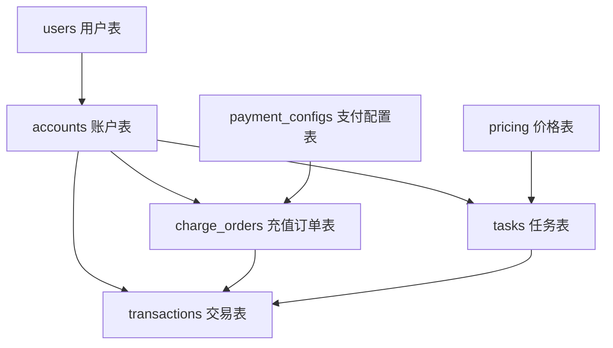

# Lumina 交易系统设计文档

## 📋 概述

Lumina 采用**预付费 + 余额扣费**的交易模式，用户需要先充值到账户余额，然后使用余额支付任务费用。本文档详细说明交易系统的设计原理、数据流转和实现细节。

---

## 🏗️ 系统架构

### 核心表结构



### 关键表设计

#### 1. accounts（账户表）
```sql
accounts {
  id: serial
  userId: integer (外键 -> users.id)
  balance: bigint (余额，单位：分)
  createdAt: timestamp
  updatedAt: timestamp
}
```

**设计要点**：
- 余额以**分**为单位存储，避免浮点数精度问题
- 一个用户对应一个账户（1:1 关系）

---

#### 2. transactions（交易表）

```sql
transactions {
  id: bigserial
  accountId: integer (外键 -> accounts.id)
  category: enum (交易分类)
  amount: bigint (金额，正数=收入，负数=支出)
  balanceBefore: bigint (交易前余额)
  balanceAfter: bigint (交易后余额)
  taskId: integer (关联任务，可选)
  chargeOrderId: bigint (关联充值订单，可选)
  paymentMethod: enum (支付方式)
  externalOrderId: text (第三方交易号)
  metadata: jsonb (元数据)
  createdAt: timestamp
}
```

**设计原则**：
- **不可变账本**（Immutable Ledger）：交易记录只增不改
- **复式记账**：记录余额变动前后快照（balanceBefore/balanceAfter）
- **分类清晰**：通过 category 区分交易类型
- **可追溯**：通过 taskId/chargeOrderId 关联源头

**交易分类**（category）：
| 分类                    | 说明         | amount 符号 | 关联字段      |
| ----------------------- | ------------ | ----------- | ------------- |
| `recharge`              | 用户充值     | 正数        | chargeOrderId |
| `task_charge`           | 任务预扣费   | 负数        | taskId        |
| `task_refund`           | 任务退款     | 正数        | taskId        |
| `image_analysis_charge` | 图片分析费用 | 负数        | -             |

---

#### 3. charge_orders（充值订单表）

```sql
charge_orders {
  id: bigserial
  accountId: integer (外键 -> accounts.id)
  amount: bigint (充值金额，分)
  provider: enum (支付方式：alipay/wechat/stripe/manual)
  outTradeNo: text (商户订单号，唯一)
  externalTransactionId: text (第三方交易号)
  paymentCredential: jsonb (支付凭证，如二维码)
  status: enum (订单状态)
  expireTime: timestamp (过期时间)
  paidAt: timestamp (支付时间)
  transactionId: bigint (关联交易记录)
  metadata: jsonb (元数据)
  createdAt: timestamp
  updatedAt: timestamp
}
```

**订单状态流转**：
```
pending (待支付) 
  ├─> success (支付成功)
  ├─> closed (已关闭：超时/取消)
  └─> failed (支付失败)
```

---

#### 4. tasks（任务表）

```sql
tasks {
  id: serial
  accountId: integer (外键 -> accounts.id)
  pricingId: integer (外键 -> pricing.id)
  billingType: enum (计费类型)
  estimatedCost: integer (预估费用，分)
  actualCost: integer (实际费用，分)
  actualUsage: numeric (实际使用量)
  status: enum (任务状态)
  ...
}
```

**费用字段说明**：
- `estimatedCost`：创建任务时根据预期使用量计算的预估费用
- `actualCost`：任务完成后根据实际使用量结算的最终费用
- 差额处理：`estimatedCost - actualCost` 通过 `task_refund` 交易退还

---

## 💰 交易流程详解

### 流程 1: 用户充值

#### 1.1 创建充值订单

**API**: `POST /api/alipay/create-order`

```typescript
// 请求
{ amount: 100 } // 单位：元

// 成功响应
{
  success: true,
  data: {
    chargeOrderId: 1,
    outTradeNo: 'ALI17012345671234ABCD',
    qrCode: 'https://qr.alipay.com/xxx',
    amount: 100,
    expireTime: 600,
    expireAt: '2024-12-02T09:00:00Z'
  }
}

// 错误响应（余额不足示例）
{
  success: false,
  error: '充值金额必须在 1-100000 元之间'
}

// charge_orders 记录
{
  accountId: 1,
  amount: 10000, // 100元 = 10000分
  provider: 'alipay',
  outTradeNo: 'ALI17012345671234ABCD',
  status: 'pending',
  paymentCredential: { alipay: { qrCode: 'https://...' } },
  expireTime: '2024-12-02T09:00:00Z'
}
```

---

#### 1.2 支付回调处理

**API**: `POST /api/alipay/notify` (由支付宝服务器调用)

```typescript
// 回调流程（原子性事务）
await db.transaction(async (tx) => {
  // 1. 锁定订单（防止并发）
  const order = await tx.select()
    .from(chargeOrders)
    .where(eq(chargeOrders.outTradeNo, outTradeNo))
    .for('update')
  
  // 2. 幂等性检查
  if (order.status === 'success') return // 已处理，跳过
  
  // 3. 验证订单状态和金额
  if (order.status !== 'pending') throw Error('状态异常')
  if (alipayAmount !== order.amount) throw Error('金额不符')
  
  // 4. 锁定账户
  const account = await tx.select()
    .from(accounts)
    .where(eq(accounts.id, order.accountId))
    .for('update')
  
  // 5. 更新订单状态
  await tx.update(chargeOrders)
    .set({
      status: 'success',
      externalTransactionId: trade_no,
      paidAt: new Date()
    })
  
  // 6. 创建交易记录
  const newBalance = account.balance + order.amount
  const txn = await tx.insert(transactions)
    .values({
      accountId: account.id,
      category: 'recharge',
      amount: order.amount, // 正数
      balanceBefore: account.balance,
      balanceAfter: newBalance,
      chargeOrderId: order.id,
      paymentMethod: 'alipay',
      externalOrderId: trade_no
    })
  
  // 7. 更新账户余额
  await tx.update(accounts)
    .set({ balance: newBalance })
  
  // 8. 关联交易ID到订单
  await tx.update(chargeOrders)
    .set({ transactionId: txn.id })
})
```

**关键安全措施**：
- ✅ **签名验证**：防止伪造回调
- ✅ **数据库锁**：`SELECT FOR UPDATE` 防止并发冲突
- ✅ **幂等性**：检查订单状态，重复回调不会重复入账
- ✅ **金额验证**：验证支付金额与订单金额一致
- ✅ **原子性**：所有操作在同一事务中，要么全部成功要么全部回滚

---

#### 1.3 查询订单状态（兜底机制）

**API**: `GET /api/alipay/query-order?outTradeNo=xxx`

```typescript
// 用途
1. 前端轮询查询支付状态
2. 回调丢失时的兜底对账

// 兜底逻辑
if (本地订单状态 === 'pending' && 支付宝订单状态 === 'TRADE_SUCCESS') {
  // 执行与 notify 相同的原子更新逻辑
  // 标记 metadata.updatedBy = 'query-order'
}
```

---

### 流程 2: 任务扣费

#### 2.1 创建任务时预扣费

**流程**：
```typescript
// 1. 计算预估费用
const pricing = await getPricing(taskType)
const estimatedCost = calculateCost(pricing, estimatedUsage)

// 2. 检查余额
if (account.balance < estimatedCost) {
  throw new Error('余额不足')
}

// 3. 在事务中创建任务和扣费记录
await db.transaction(async (tx) => {
  // 3.1 创建任务
  const task = await tx.insert(tasks).values({
    accountId: account.id,
    estimatedCost,
    status: 'pending',
    ...
  })
  
  // 3.2 锁定账户
  const acc = await tx.select()
    .from(accounts)
    .where(eq(accounts.id, account.id))
    .for('update')
  
  // 3.3 创建扣费交易
  const newBalance = acc.balance - estimatedCost
  await tx.insert(transactions).values({
    accountId: acc.id,
    category: 'task_charge',
    amount: -estimatedCost, // 负数
    balanceBefore: acc.balance,
    balanceAfter: newBalance,
    taskId: task.id,
    paymentMethod: 'balance'
  })
  
  // 3.4 更新账户余额
  await tx.update(accounts)
    .set({ balance: newBalance })
})
```

**账户余额变化**：
```
余额前: 10000分 (100元)
扣费: -8000分 (80元, estimatedCost)
余额后: 2000分 (20元)
```

---

#### 2.2 任务完成后结算

**流程**：
```typescript
// 任务完成后
const actualCost = calculateActualCost(actualUsage)
const refundAmount = task.estimatedCost - actualCost

if (refundAmount > 0) {
  // 多退：创建退款交易
  await db.transaction(async (tx) => {
    // 1. 更新任务实际费用
    await tx.update(tasks)
      .set({ 
        actualCost,
        actualUsage 
      })
    
    // 2. 锁定账户
    const account = await tx.select()
      .from(accounts)
      .where(eq(accounts.id, task.accountId))
      .for('update')
    
    // 3. 创建退款交易
    const newBalance = account.balance + refundAmount
    await tx.insert(transactions).values({
      accountId: account.id,
      category: 'task_refund',
      amount: refundAmount, // 正数
      balanceBefore: account.balance,
      balanceAfter: newBalance,
      taskId: task.id,
      paymentMethod: 'balance',
      metadata: { refundReason: '实际费用低于预估' }
    })
    
    // 4. 更新账户余额
    await tx.update(accounts)
      .set({ balance: newBalance })
  })
}
```

**示例**：
```
预估费用: 8000分
实际费用: 6000分
退款金额: 2000分

余额前: 2000分
退款: +2000分
余额后: 4000分
```

---

## 📊 交易记录示例

### 示例 1: 完整充值流程

```sql
-- 1. 充值订单
INSERT INTO charge_orders VALUES (
  id: 1,
  accountId: 100,
  amount: 10000, -- 100元
  provider: 'alipay',
  outTradeNo: 'ALI17012345671234ABCD',
  status: 'success',
  externalTransactionId: '2024120222001234567890'
);

-- 2. 充值交易
INSERT INTO transactions VALUES (
  id: 1,
  accountId: 100,
  category: 'recharge',
  amount: 10000, -- 正数
  balanceBefore: 0,
  balanceAfter: 10000,
  chargeOrderId: 1,
  paymentMethod: 'alipay',
  externalOrderId: '2024120222001234567890'
);

-- 3. 账户余额
UPDATE accounts SET balance = 10000 WHERE id = 100;
```

---

### 示例 2: 任务扣费和退款

```sql
-- 1. 任务创建（预扣费）
INSERT INTO transactions VALUES (
  id: 2,
  accountId: 100,
  category: 'task_charge',
  amount: -8000, -- 负数
  balanceBefore: 10000,
  balanceAfter: 2000,
  taskId: 1,
  paymentMethod: 'balance'
);

-- 2. 任务完成（退款）
INSERT INTO transactions VALUES (
  id: 3,
  accountId: 100,
  category: 'task_refund',
  amount: 2000, -- 正数
  balanceBefore: 2000,
  balanceAfter: 4000,
  taskId: 1,
  paymentMethod: 'balance',
  metadata: '{"refundReason": "实际费用低于预估"}'
);
```

---

## 🔍 对账和审计

### 余额验证

通过交易记录可以验证账户余额的正确性：

```sql
-- 验证账户余额
SELECT 
  a.id,
  a.balance AS current_balance,
  COALESCE(SUM(t.amount), 0) AS calculated_balance
FROM accounts a
LEFT JOIN transactions t ON t.accountId = a.id
WHERE a.id = 100
GROUP BY a.id, a.balance;

-- 如果 current_balance = calculated_balance，则账户一致
```

---

### 交易流水查询

```sql
-- 查询用户所有交易
SELECT 
  t.id,
  t.category,
  t.amount / 100.0 AS amount_yuan,
  t.balanceBefore / 100.0 AS before_yuan,
  t.balanceAfter / 100.0 AS after_yuan,
  t.paymentMethod,
  t.createdAt
FROM transactions t
WHERE t.accountId = 100
ORDER BY t.createdAt DESC;
```

**输出示例**：
```
id | category     | amount | before | after  | method  | createdAt
1  | recharge     | +100.00| 0.00   | 100.00 | alipay  | 2024-12-02 08:00
2  | task_charge  | -80.00 | 100.00 | 20.00  | balance | 2024-12-02 08:10
3  | task_refund  | +20.00 | 20.00  | 40.00  | balance | 2024-12-02 08:30
```

---

## ✅ 设计优势

### 1. 数据一致性

- **原子性事务**：所有余额变动在事务中完成
- **数据库锁**：防止并发冲突
- **余额快照**：每笔交易记录前后余额，便于追溯

---

### 2. 可审计性

- **不可变账本**：交易记录只增不改
- **完整链路**：充值 → 扣费 → 退款全链路可追溯
- **外部对账**：通过 externalOrderId 关联第三方交易

---

### 3. 安全性

- **签名验证**：防止伪造支付回调
- **幂等性保护**：重复回调不会重复入账
- **金额验证**：严格验证支付金额
- **权限隔离**：用户只能操作自己的订单

---

### 4. 灵活性

- **多支付方式**：支持支付宝、微信、Stripe
- **多交易类型**：充值、任务扣费、退款、图片分析等
- **扩展性**：通过 metadata 存储额外信息

---

## 🔧 与实施代码的对应关系

### 充值流程

| 步骤        | API                             | 操作的表                                        | 说明              |
| ----------- | ------------------------------- | ----------------------------------------------- | ----------------- |
| 1. 创建订单 | `POST /api/alipay/create-order` | `charge_orders`                                 | 插入 pending 订单 |
| 2. 支付回调 | `POST /api/alipay/notify`       | `charge_orders`<br>`transactions`<br>`accounts` | 原子更新三张表    |
| 3. 查询订单 | `GET /api/alipay/query-order`   | 同上                                            | 兜底对账逻辑      |
| 4. 关闭订单 | `POST /api/alipay/close-order`  | `charge_orders`                                 | 更新为 closed     |

---

### 任务扣费流程

| 步骤        | 位置         | 操作的表                                | 说明               |
| ----------- | ------------ | --------------------------------------- | ------------------ |
| 1. 创建任务 | 任务创建 API | `tasks`<br>`transactions`<br>`accounts` | 预扣 estimatedCost |
| 2. 任务完成 | 任务完成回调 | `tasks`<br>`transactions`<br>`accounts` | 退还差额           |

---

## 📝 总结

Lumina 的交易系统设计完全符合标准的**预付费 + 复式记账**模式：

1. ✅ **充值系统**：通过 `charge_orders` + `transactions` 实现，支持多种支付方式
2. ✅ **扣费系统**：通过 `tasks` + `transactions` 实现预付费和结算退款
3. ✅ **账户系统**：通过 `accounts` + `transactions` 实现余额管理和审计
4. ✅ **安全保障**：事务、锁、幂等性、签名验证全方位保护
5. ✅ **可追溯性**：所有金额变动都有完整的交易记录

**核心设计原则**遵循金融级系统标准：
- 不可变账本（Immutable Ledger）
- 复式记账（Double-entry Bookkeeping）
- 原子性事务（ACID Transaction）
- 幂等性设计（Idempotent）
